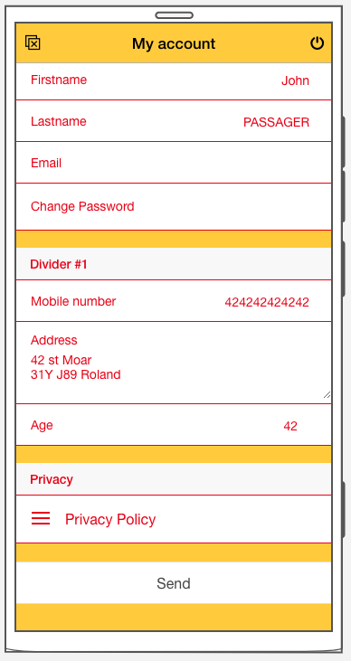

# My account

[Edit this on Github](https://github.com/Xtraball/SiberianCMS-Doc/edit/master/docs/module/account.md)

## Account fields

With the 4.16.0 update, you are now allowed to extend `My account` with more fields for your modules.

*Important* `Account::addFields` must be used within the following hook from `init.php`

```php
<?php

use Siberian\Hook;

Hook::listen("mobile.controller.init", "mymodule_extendedfields", "extendedFields");
```




```php
<?php

Account::addFields(string $moduleName, array $fields, function $populateCallback, function $saveCallback);
```

```php
<?php

use Siberian\Account;

function extendedFields ($payload) {
    Account::addFields(
        "MyModule",
        [
            [
                "type" => "spacer",
                "key" => "mymodule_spacer",
            ],
            [
                "type" => "divider",
                "key" => "mymodule_divider",
                "label" => __("Divider #1"),
            ],
            [
                "type" => "text",
                "key" => "mobile_number",
                "label" => __("Mobile number"),
            ],
            [
                "type" => "textarea",
                "key" => "address",
                "rows" => "3",
                "label" => __("Address"),
            ],
            [
                "type" => "number",
                "key" => "age",
                "min" => "1",
                "max" => "100",
                "step" => "1",
                "label" => __("Age"),
            ]
        ],
        "populateMyFields",
        "saveMyFields"
    );
    return $payload;
}
```


---


The different field types

Type|Usage
---|---
spacer|This is a 20px blank spacer, simple.
divider|This is a divider title, it uses `item item-divider item-divider-custom` classes
text|A simple text input
textarea|A textarea with configurable rows
number|A range input with `min`, `max` & `step` settings 
select|A dropdown selector with `options: {["value": "single", "label": "Single"], ["value": "married", "label": "Married"]}`


---


Callback examples

The *$populateCallback* is called before generating the fields, it's used to populate them with the actual values and/or with defaults.

Note: *$populateCallback* must be a pure function accessible from everywhere, it's a good practice to declare it inside `init.php`


```php
<?php

function populateExtended ($context, $fields) 
{
    /**
     * @var $context
     * [
     *   "application" => (current application),
     *   "request" => (current request),
     *   "session" => (user session)
     * ]
     * @var $fields
     * [
     *    [
     *       "key" => "#Field_key#",
     *       "value" => "#Field_value", // defaults empty
     *    ],
     *    [...]
     * ]
     */
    
    $customer = $context["session"]->getCustomer();
    foreach ($fields as &$field) {
        switch ($field["key"]) {
            case "mobile_number":
                $field["value"] = $customer->getMobileNumber();
                break;
            case "address":
                $field["value"] = $customer->getAddress();
                break;
            case "age":
                $field["value"] = $customer->getAge();
                break;
        }
    }
    
    return $fields;
}
```

The *$saveCallback* is called before generating the fields, it's used to populate them with the actual values and/or with defaults.

Note: *$saveCallback* must be a pure function accessible from everywhere, it's a good practice to declare it inside `init.php`

```php
<?php

function saveExtended ($context, $fields) 
{
    /**
     * @var $context
     * [
     *   "application" => (current application),
     *   "request" => (current request),
     *   "session" => (user session)
     * ]
     * @var $fields
     * [
     *    [
     *       "key" => "#Field_key#",
     *       "value" => "#Field_value", // defaults empty
     *    ],
     *    [...]
     * ]
     */
    
    $customer = $context["session"]->getCustomer();
    foreach ($fields as $field) {
        switch ($field["key"]) {
            case "mobile_number":
                $customer->setMobileNumber($field["value"]);
                break;
            case "address":
                $customer->setAddress($field["value"]);
                break;
            case "age":
                $customer->setAge($field["value"]);
                break;
        }
    }
    
    // Finally save the customer
    $customer->save();
    
    return $fields;
}
```